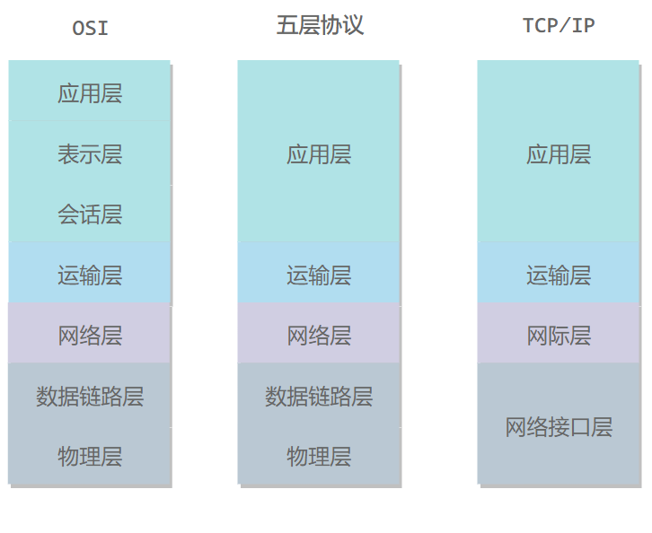
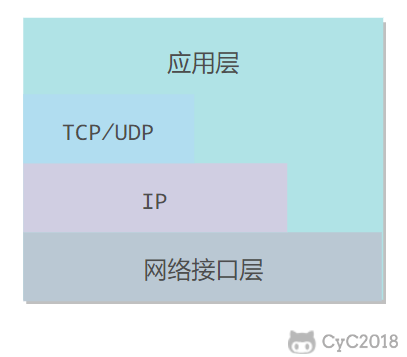

# 1 计算机网络模型

## 1.1 网络模型

### 1.1 OSI七层模型

**”物数网运会表应“**：

（7）应用层：为特定的程序提供数据传输服务，例如HTTP、DNS等协议。数据单位为报文；

（6）表示层：数据压缩、加密以及数据描述，这使得应用程序不用关心各台主机中数据内部格式不同的问题；

（5）会话层：建立及管理会话；

（4）运输层：为进程提供通用数据传输服务。由于应用层协议很多，定义通用的传输层协议就可以支持不断增多的应用层协议。运输层包括两种协议：**传输控制协议 TCP，提供面向连接、可靠的数据传输服务，数据单位为报文段**；**用户数据报协议 UDP，提供无连接、尽最大努力的数据传输服务，数据单位为用户数据报**。TCP 主要提供完整性服务，UDP 主要提供及时性服务。

（3）网络层：为主机提供数据传输服务。而传输层协议是为主机中的进程提供数据传输服务。网络层**把传输层传递下来的报文段或者用户数据报封装成分组**。

（2）数据链路层：网络层针对的还是主机之间的数据传输服务，而主机之间可以有很多链路，链路层协议就是为同一链路的主机提供数据传输服务。数据链路层把网络层传下来的分组封装成帧。

（1）物理层：考虑的是怎样在传输媒体上传输数据比特流，而不是指具体的传输媒体。物理层的作用是尽可能**屏蔽传输媒体和通信手段的差异**，使数据链路层感觉不到这些差异。

### 1.2 TCP/IP模型

TCP/IP模型只有四层模型，它是将OSI七层模型的上面三层合并为**应用层**，底下两层合并为**网络接口层**。

### 1.3 数据在各层之间的传递过程

在向下的过程中，需要添加下层协议所需要的首部或者尾部；而在向上的过程中不断拆开首部和尾部。

路由器只有**下面三层协议**，因为路由器位于网络核心中，**不需要为进程或者应用程序提供服务**，因此也就不需要传输层和应用层。

## 1.2 应用层

主要作用：能够写出运行在不同端系统和通过网络彼此通信的程序，而不需要在网络核心设备上（路由器、链路层交换机）运行的软件。

### 1.2.1 应用程序体系结构

（1）C/S体系结构

（2）P2P体系结构

### 1.2.2 应用层本质

程序之间的通信本质上是**进程间的通信**，而网络通信实际上就是进程间跨越计算机网络**交换报文**。

套接字（Socket）：进程通过套接字从网络收发报文，所以套接字是进程与计算机网络之间的接口。从网络模型的角度上来说，套接字是应用层与运输层之间的接口。

### 1.2.3 Web页面请求过程

（1）**DHCP 配置主机信息**

- 假设主机最开始没有 IP 地址以及其它信息，那么就需要先使用 DHCP 来获取。
- 主机生成一个 DHCP 请求报文，并将这个报文放入具有目的端口 67 和源端口 68 的 UDP 报文段中。
- 该报文段则被放入在一个具有广播 IP 目的地址(255.255.255.255) 和源 IP 地址（0.0.0.0）的 IP 数据报中。
- 该数据报则被放置在 MAC 帧中，该帧具有目的地址 FF:<zero-width space>FF:<zero-width space>FF:<zero-width space>FF:<zero-width space>FF:FF，将广播到与交换机连接的所有设备。
- 连接在交换机的 DHCP 服务器收到广播帧之后，不断地向上分解得到 IP 数据报、UDP 报文段、DHCP 请求报文，之后生成 DHCP ACK 报文，该报文包含以下信息：IP 地址、DNS 服务器的 IP 地址、默认网关路由器的 IP 地址和子网掩码。该报文被放入 UDP 报文段中，UDP 报文段有被放入 IP 数据报中，最后放入 MAC 帧中。
- 该帧的目的地址是请求主机的 MAC 地址，因为交换机具有自学习能力，之前主机发送了广播帧之后就记录了 MAC 地址到其转发接口的交换表项，因此现在交换机就可以直接知道应该向哪个接口发送该帧。
- 主机收到该帧后，不断分解得到 DHCP 报文。之后就配置它的 IP 地址、子网掩码和 DNS 服务器的 IP 地址，并在其 IP 转发表中安装默认网关。

（2）**ARP解析MAC地址**

- 主机通过浏览器生成一个 TCP 套接字，套接字向 HTTP 服务器发送 HTTP 请求。为了生成该套接字，主机需要知道网站的域名对应的 IP 地址。
- 主机生成一个 DNS 查询报文，该报文具有 53 号端口，因为 DNS 服务器的端口号是 53。
- 该 DNS 查询报文被放入目的地址为 DNS 服务器 IP 地址的 IP 数据报中。
- 该 IP 数据报被放入一个以太网帧中，该帧将发送到网关路由器。
- DHCP 过程只知道网关路由器的 IP 地址，为了获取网关路由器的 MAC 地址，需要使用 ARP 协议。
- 主机生成一个包含目的地址为网关路由器 IP 地址的 ARP 查询报文，将该 ARP 查询报文放入一个具有广播目的地址（FF:<zero-width space>FF:<zero-width space>FF:<zero-width space>FF:<zero-width space>FF:FF）的以太网帧中，并向交换机发送该以太网帧，交换机将该帧转发给所有的连接设备，包括网关路由器。
- 网关路由器接收到该帧后，不断向上分解得到 ARP 报文，发现其中的 IP 地址与其接口的 IP 地址匹配，因此就发送一个 ARP 回答报文，包含了它的 MAC 地址，发回给主机。

（3）**DNS解析域名**

- 知道了网关路由器的 MAC 地址之后，就可以继续 DNS 的解析过程了。
- 网关路由器接收到包含 DNS 查询报文的以太网帧后，抽取出 IP 数据报，并根据转发表决定该 IP 数据报应该转发的路由器。
- 因为路由器具有内部网关协议（RIP、OSPF）和外部网关协议（BGP）这两种路由选择协议，因此路由表中已经配置了网关路由器到达 DNS 服务器的路由表项。
- 到达 DNS 服务器之后，DNS 服务器抽取出 DNS 查询报文，并在 DNS 数据库中查找待解析的域名。
- 找到 DNS 记录之后，发送 DNS 回答报文，将该回答报文放入 UDP 报文段中，然后放入 IP 数据报中，通过路由器反向转发回网关路由器，并经过以太网交换机到达主机。

（4）**HTTP请求页面**

- 有了 HTTP 服务器的 IP 地址之后，主机就能够生成 TCP 套接字，该套接字将用于向 Web 服务器发送 HTTP GET 报文。
- 在生成 TCP 套接字之前，必须先与 HTTP 服务器进行三次握手来建立连接。生成一个具有目的端口 80 的 TCP SYN 报文段，并向 HTTP 服务器发送该报文段。
- HTTP 服务器收到该报文段之后，生成 TCP SYN ACK 报文段，发回给主机。
- 连接建立之后，浏览器生成 HTTP GET 报文，并交付给 HTTP 服务器。
- HTTP 服务器从 TCP 套接字读取 HTTP GET 报文，生成一个 HTTP 响应报文，将 Web 页面内容放入报文主体中，发回给主机。
- 浏览器收到 HTTP 响应报文后，抽取出 Web 页面内容，之后进行渲染，显示 Web 页面。

### 1.2.4 常用端口

| 应用             | 应用层协议 | 端口号  | 传输层协议 | 备注                        |
| ---------------- | ---------- | ------- | ---------- | --------------------------- |
| 域名解析         | DNS        | 53      | UDP/TCP    | 长度超过 512 字节时使用 TCP |
| 动态主机配置协议 | DHCP       | 67/68   | UDP        |                             |
| 简单网络管理协议 | SNMP       | 161/162 | UDP        |                             |
| 文件传送协议     | FTP        | 20/21   | TCP        | 控制连接 21，数据连接 20    |
| 远程终端协议     | TELNET     | 23      | TCP        |                             |
| 超文本传送协议   | HTTP       | 80      | TCP        |                             |
| 简单邮件传送协议 | SMTP       | 25      | TCP        |                             |
| 邮件读取协议     | POP3       | 110     | TCP        |                             |
| 网际报文存取协议 | IMAP       | 143     | TCP        |                             |

## 1.3 运输层

## 1.4 网络层

## 1.5 数据链路层

## 1.6 物理层

本层上进行比特率的传输，详细地说就是模拟信号和数字信号的传输。