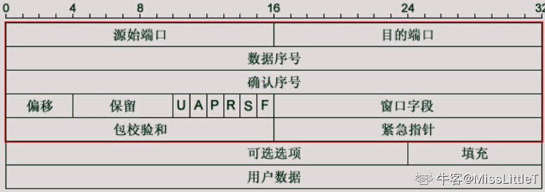

# 1 网络模型

## 1.1 OSI七层模型


**”物数网运会表应“**：

（7）应用层：为特定的程序提供数据传输服务，例如HTTP、DNS等协议。数据单位为报文；

（6）表示层：数据压缩、加密以及数据描述，这使得应用程序不用关心各台主机中数据内部格式不同的问题；

（5）会话层：建立及管理会话；

（4）运输层：为进程提供通用数据传输服务。由于应用层协议很多，定义通用的传输层协议就可以支持不断增多的应用层协议。运输层包括两种协议：**传输控制协议 TCP，提供面向连接、可靠的数据传输服务，数据单位为报文段**；**用户数据报协议 UDP，提供无连接、尽最大努力的数据传输服务，数据单位为用户数据报**。TCP 主要提供完整性服务，UDP 主要提供及时性服务。

（3）网络层：为主机提供数据传输服务。而传输层协议是为主机中的进程提供数据传输服务。网络层**把传输层传递下来的报文段或者用户数据报封装成分组**。

（2）数据链路层：网络层针对的还是主机之间的数据传输服务，而主机之间可以有很多链路，链路层协议就是为同一链路的主机提供数据传输服务。数据链路层把网络层传下来的分组封装成帧。

（1）物理层：考虑的是怎样在传输媒体上传输数据比特流，而不是指具体的传输媒体。物理层的作用是尽可能**屏蔽传输媒体和通信手段的差异**，使数据链路层感觉不到这些差异。

## 1.2 TCP/IP模型

TCP/IP模型只有四层模型，它是将OSI七层模型的上面三层合并为**应用层**，底下两层合并为**网络接口层**。


## 1.3 数据在各层之间的传递过程

在向下的过程中，需要添加下层协议所需要的首部或者尾部；而在向上的过程中不断拆开首部和尾部。

路由器只有**下面三层协议**，因为路由器位于网络核心中，**不需要为进程或者应用程序提供服务**，因此也就不需要传输层和应用层。

# 2 应用层

主要作用：能够写出运行在不同端系统和通过网络彼此通信的程序，而不需要在网络核心设备上（路由器、链路层交换机）运行的软件。

## 2.1 应用程序体系结构

（1）C/S体系结构

（2）P2P体系结构

## 2.2 应用层本质

程序之间的通信本质上是**进程间的通信**，而网络通信实际上就是进程间跨越计算机网络**交换报文**。

套接字（Socket）：进程通过套接字从网络收发报文，所以套接字是进程与计算机网络之间的接口。从网络模型的角度上来说，套接字是应用层与运输层之间的接口。

## 2.3 Web页面请求过程

（1）**DHCP 配置主机信息**

- 假设主机最开始没有 IP 地址以及其它信息，那么就需要先使用 DHCP 来获取。
- 主机生成一个 DHCP 请求报文，并将这个报文放入具有目的端口 67 和源端口 68 的 UDP 报文段中。
- 该报文段则被放入在一个具有广播 IP 目的地址(255.255.255.255) 和源 IP 地址（0.0.0.0）的 IP 数据报中。
- 该数据报则被放置在 MAC 帧中，该帧具有目的地址 FF:<zero-width space>FF:<zero-width space>FF:<zero-width space>FF:<zero-width space>FF:FF，将广播到与交换机连接的所有设备。
- 连接在交换机的 DHCP 服务器收到广播帧之后，不断地向上分解得到 IP 数据报、UDP 报文段、DHCP 请求报文，之后生成 DHCP ACK 报文，该报文包含以下信息：IP 地址、DNS 服务器的 IP 地址、默认网关路由器的 IP 地址和子网掩码。该报文被放入 UDP 报文段中，UDP 报文段有被放入 IP 数据报中，最后放入 MAC 帧中。
- 该帧的目的地址是请求主机的 MAC 地址，因为交换机具有自学习能力，之前主机发送了广播帧之后就记录了 MAC 地址到其转发接口的交换表项，因此现在交换机就可以直接知道应该向哪个接口发送该帧。
- 主机收到该帧后，不断分解得到 DHCP 报文。之后就配置它的 IP 地址、子网掩码和 DNS 服务器的 IP 地址，并在其 IP 转发表中安装默认网关。

（2）**ARP解析MAC地址**

- 主机通过浏览器生成一个 TCP 套接字，套接字向 HTTP 服务器发送 HTTP 请求。为了生成该套接字，主机需要知道网站的域名对应的 IP 地址。
- 主机生成一个 DNS 查询报文，该报文具有 53 号端口，因为 DNS 服务器的端口号是 53。
- 该 DNS 查询报文被放入目的地址为 DNS 服务器 IP 地址的 IP 数据报中。
- 该 IP 数据报被放入一个以太网帧中，该帧将发送到网关路由器。
- DHCP 过程只知道网关路由器的 IP 地址，为了获取网关路由器的 MAC 地址，需要使用 ARP 协议。
- 主机生成一个包含目的地址为网关路由器 IP 地址的 ARP 查询报文，将该 ARP 查询报文放入一个具有广播目的地址（FF:<zero-width space>FF:<zero-width space>FF:<zero-width space>FF:<zero-width space>FF:FF）的以太网帧中，并向交换机发送该以太网帧，交换机将该帧转发给所有的连接设备，包括网关路由器。
- 网关路由器接收到该帧后，不断向上分解得到 ARP 报文，发现其中的 IP 地址与其接口的 IP 地址匹配，因此就发送一个 ARP 回答报文，包含了它的 MAC 地址，发回给主机。

（3）**DNS解析域名**

- 知道了网关路由器的 MAC 地址之后，就可以继续 DNS 的解析过程了。
- 网关路由器接收到包含 DNS 查询报文的以太网帧后，抽取出 IP 数据报，并根据转发表决定该 IP 数据报应该转发的路由器。
- 因为路由器具有内部网关协议（RIP、OSPF）和外部网关协议（BGP）这两种路由选择协议，因此路由表中已经配置了网关路由器到达 DNS 服务器的路由表项。
- 到达 DNS 服务器之后，DNS 服务器抽取出 DNS 查询报文，并在 DNS 数据库中查找待解析的域名。
- 找到 DNS 记录之后，发送 DNS 回答报文，将该回答报文放入 UDP 报文段中，然后放入 IP 数据报中，通过路由器反向转发回网关路由器，并经过以太网交换机到达主机。

（4）**HTTP请求页面**

- 有了 HTTP 服务器的 IP 地址之后，主机就能够生成 TCP 套接字，该套接字将用于向 Web 服务器发送 HTTP GET 报文。
- 在生成 TCP 套接字之前，必须先与 HTTP 服务器进行三次握手来建立连接。生成一个具有目的端口 80 的 TCP SYN 报文段，并向 HTTP 服务器发送该报文段。
- HTTP 服务器收到该报文段之后，生成 TCP SYN ACK 报文段，发回给主机。
- 连接建立之后，浏览器生成 HTTP GET 报文，并交付给 HTTP 服务器。
- HTTP 服务器从 TCP 套接字读取 HTTP GET 报文，生成一个 HTTP 响应报文，将 Web 页面内容放入报文主体中，发回给主机。
- 浏览器收到 HTTP 响应报文后，抽取出 Web 页面内容，之后进行渲染，显示 Web 页面。

## 2.4 常用端口

| 应用             | 应用层协议 | 端口号  | 传输层协议 | 备注                        |
| ---------------- | ---------- | ------- | ---------- | --------------------------- |
| 域名解析         | DNS        | 53      | UDP/TCP    | 长度超过 512 字节时使用 TCP |
| 动态主机配置协议 | DHCP       | 67/68   | UDP        |                             |
| 简单网络管理协议 | SNMP       | 161/162 | UDP        |                             |
| 文件传送协议     | FTP        | 20/21   | TCP        | 控制连接 21，数据连接 20    |
| 远程终端协议     | TELNET     | 23      | TCP        |                             |
| 超文本传送协议   | HTTP       | 80      | TCP        |                             |
| 简单邮件传送协议 | SMTP       | 25      | TCP        |                             |
| 邮件读取协议     | POP3       | 110     | TCP        |                             |
| 网际报文存取协议 | IMAP       | 143     | TCP        |                             |


# 3 运输层

运输层提供了进程间的逻辑通信。运输层向高层用户屏蔽了下面网络的核心细节，使应用程序看起来像是在两个运输层实体之间有一条端到端的逻辑通信信道。

TCP和UDP的区别：

（1）传输控制协议（Transmission Control Protocol，TCP）：面向**连接**的，提供**可靠交付**，有流量控制，拥塞控制，提供**全双工通信**，面向**字节流**（把应用层传下来的报文看成字节流，把字节流组织成大小不等的数据块），每一条 TCP 连接只能是**点对点**的（一对一）。

（2）用户数据报协议（User Datagram Protocol，UDP）：**无连接**的，**尽最大努力交付**，没有拥塞控制，面向**报文**（对于应用程序传下来的报文不合并也不拆分，只是添加 UDP 首部），支持一对一、一对多、多对一和多对多的交互通信。

## 3.1 TCP三次握手

TCP首部固定20个字节的长度:



（1）源端口和目的端口（16位）：和IP首部的源IP地址和目的IP地址可以唯一确定一个TCP连接；

（２）序号（32位）：表示在这个报文段中第一个数据字节序号；

（3）确认序号（32位）：仅当ACK标志为1时有效，确认号表示期望收到的下一个字节的序号；

（4）偏移（4位）：头部长度；

（6）保留（6位），必须为0；

（7）6个标志位（各1位）：

- URG-紧急指针有效；
- ACK-确认序号有效；
- PSH-接收方应尽快将这个报文交给应用层；
- RST-连接重置；
- SYN-同步序号用来发起一个连接；
- FIN-终止一个连接。

（8）窗口字段（16位）：代表窗口的字节容量，标准大小为2^16-1=65535个字节；

（9）包校验和（16位）：机器基于数据内容计算一个数值，收信息机要与源机器数值结果完全一样，从而证明数据的有效性。检验和覆盖了整个的TCP报文段：这是一个强制性的字段，一定是由发送端计算和存储，并由接收端进行验证的。

### 3.1.1 过程

为了保证数据传输成功，TCP采用三次握手策略：


（1）客户端向服务器发送**连接请求报文**段，SYN=1，序号seq=x，此时客户端进入**SYN-SENT**（同步已发送）状态。

【**第一次的seq序列号x是随机产生的**，这样是为了**网络安全**。如果不是随机产生初始序列号，黑客将会以很容易的方式获取到你与其他主机之间的初始化序列号，并且伪造序列号进行攻击】

（2）服务器收到连接请求报文，如果同意建立连接，则向客户端发送**连接确认报文段**，SYN=1，ACK=1，确认序号为ack=x+1，自己的序号seq=y，服务器进入SYN-RCVD（**同步已收到**）状态

【**SYN 是为了告诉发送端，发送方到接收方的通道没问题**；**ACK 用来验证接收方到发送方的通道没问题**】

（3）客户端收到服务器的连接确认报文后，还要向服务器**发出确认**，ACK=1，确认号为ack=y+1，自己的序号为seq=x+1，然后客户端进入**ESTABLISHED**（已建立连接）状态。

【最后一次确认是为了防止已经失效的连接请求报文段又传回到了服务端，从而产生错误】

（TCP规定，SYN报文段（SYN= 1）不能携带数据，但是会**消耗一个序号**，而ACK报文段**可以携带数据，但不携带数据就不消耗序号**）

### 3.1.2 为什么要进行三次握手？

TCP进行三次握手的原因是让通信双方确认**自己和对方的发送和接收**是正常的，建立可靠的通信信道。

### 3.1.3 为什么要进行第三次握手？

防止**已经失效的连接请求报文**又突然传送到了服务器，从而产生错误。

如何只有两次握手，可能会出现以下情况：

- 客户端发送了第一个请求连接并且没有丢失，但由于网络原因在节点中滞留。
- 由于TCP的客户端迟迟没有收到确认报文，以为服务器没有收到，此时重新向服务器发送这条报文，此后客户端和服务器经过两次握手完成连接，传输数据，然后关闭连接。 
- 此时此前滞留的那一次请求连接，网络通畅了到达服务器，这个报文本该是失效的，但是，两次握手的机制将会让客户端和服务器再次建立连接，这将导致不必要的错误和资源的浪费。 
- 如果采用的是三次握手，就算是那一次失效的报文传送过来了，服务端接受到了那条失效报文并且回复了确认报文，但是客户端不会再次发出确认。由于服务器收不到确认，就知道客户端并没有请求连接。

### 3.1.4 最后一次握手丢失会发生什么？

- 如果最后一次ACK在网络中丢失，那么**服务端该TCP连接的状态仍为SYN_RECV**，并且根据 TCP的**超时重传机制**依次等待3秒、6秒、12秒后重新发送 SYN+ACK 包，默认重复5次，以便 **客户端重新发送ACK包** 
- 如果重发指定次数后，**仍然未收到ACK应答**，那么一段时间后，**服务端自动关闭这个连接** 
- 但是客户端认为这个连接已经建立，如果客户端端向服务端发送数据，**服务端将以RST包（Reset，RST标示复位，用于异常的关闭连接）响应**，此时，**客户端知道第三次握手失败**

### 3.1.5 SYN洪泛攻击是什么？

SYN洪泛（SYN Flood）攻击，利用TCP协议缺陷，发送大量伪造的TCP连接请求，常用假冒的IP或IP号段发来海量的**请求连接的第一个握手包（SYN包）**，被攻击服务器回应第二个握手包（SYN+ACK包），因为对方是假冒IP，对方永远收不到包且不会回应第三个握手包。**导致被攻击服务器保持大量SYN_RECV状态的“半连接”**，并且会重试默认5次回应第二个握手包，**大量随机的恶意SYN占满了未完成连接队列，导致正常合法的SYN排不上队列，让正常的业务请求连接不进来**。【服务器端的资源分配是在**二次握手时分配**的，而客户端的资源是在完成**三次握手时分配**的，所以服务器容易受到SYN洪泛攻击】

解决方法:

- 缩短超时重传时间（SYN Timeout）时间
- 增加最大半连接数
- 过滤网关防护
- SYN cookies技术

1. **当服务器接受到 SYN 报文段时，不直接为该 TCP 分配资源**，而只是打开一个半开的套接字。接着会使用 SYN 报文段的源 Id，目的 Id，端口号以及只有服务器自己知道的一个秘密函数**生成一个 cookie，并把 cookie 作为序列号响应给客户端**。 
2. **如果客户端是正常建立连接，将会返回一个确认字段为 cookie + 1 的报文段**。接下来服务器会根据确认报文的源 Id，目的 Id，端口号以及秘密函数计算出一个结果，**如果结果的值 + 1 等于确认字段的值，则证明是刚刚请求连接的客户端，这时候才为该 TCP 分配资源**

### 3.1.6 TCP握手后，客户端掉线了服务器知道吗？

三次握手完成后，若客户端掉线了，由于**保活机制**在连接后会隔一段时间发送一个**保活探测报文**，超过保活探测次数的话服务器就会知道，然后就及时关闭连接。

如果短时间内客户端重新上线，若双方都没有释放连接的话，则不需要重新握手。

## 3.2 TCP四次挥手

### 3.2.1 过程


（1）A发送连接释放报文段FIN=1，seq=u，并停止再发送数据，主动关闭TCP的连接，此时A进入终止等待１（FIN－WAIT－１）状态，等待B的确认；

（2）B收到这个FIN，发回一 个ACK确认报文ACK=1，seq=v，ack=u+1，确认序号为收到的序号加1（和 SYN 一样，一个 FIN 将占用一个序号），此时B进入关闭等待（CLOSE-WAIT）状态。此时 TCP 属于半关闭状态，A没有数据要发送了，但是若B发送数据A任然要接收。A收到来自B的确认后，进入终止等待２（FIN－WAIT-2）状态，等待B发送连接释放报文段；

（3）当B不需要发送数据时，发送一个连接释放报文段FIN=1，ACK=1，seq=w，ack=u+1，此时B进入最后确认状态（LAST-ACK），等待A的确认；

（4）A收到B的连接释放报文段后，回复确认报文段ACK=1，ack=w+1，seq=u+1，B收到回复后进入CLOSED状态，撤销相应的PCB后撤销TCP连接。而A进入到TIME-WAIT（时间等待）状态，等待２MSL（Maximum Segment Lifetime，最长报文段寿命）后进入CLOSED状态，撤销相应的传输控制块PCB后，结束本次TCP连接。

### 3.2.2 为什么挥手要四次？

建立连接的时候，服务器在LISTEN状态下收到客户端的SYN连接请求报文段后，是将SYN和ACK放在一个报文中发送给（第二次握手）客户端的。

关闭连接时，服务器收到对方的连接释放报文段后，只是代表客户端不会再发送数据了（任然能接收数据），而服务器可以选择立即关闭，也可以选择继续发送数据，所以是将ACK和FIN分开发送，从而导致多了一次。

### 3.2.3 为什么要有一个FIN-WAIT-2状态？

A接收到B的确认后（第二次挥手后），就进入到了FIN-WAIT-2状态。如果这个时候因为网络突然断掉、服务器宕机等原因导致A无法收到B的FIN报文段，这个时候就需要FIN-WAIT-2定时器。定时器超时后A还未收到B的FIN的话，就直接进入CLOSE状态，减少资源占用。

### 3.2.3 为什么最后要等2MSL？

（1）为了保证A发送的最后一个ACK能够到达B。如果处在LAST-ACK状态的B在没有收到A的ACK报文段的话，B会超时重传FIN报文段（重新第三次挥手），若A能在2MSL的时间内收到FIN报文段，A就会重传最后一次ACK报文段，并重启2MSL计时器，使得A和B都能成功进入CLOSEＤ状态。如果不等的话，A直接进入CLOSEＤ，万一B没有收到确认，就无法进入CLOSEＤ状态

（２）防止“已经失效的连接请求报文段”出现在本连接中。A在发送完最后一个ACK报文段后，再经过２MSL，就可以使本连接持续的时间内所产生的所有报文段从网络中消失。这样就可以使下一个连接中不会出现旧的连接请求报文段。

### 3.2.4 TIME-WAIT状态的连接过多产生什么后果，怎么处理？

后果：

（1）对于服务器来说，短时间内关闭了大量的客户端连接，就会造成服务器上出现大量的TIME_WAIT连接，**占据大量的tuple ，严重消耗着服务器的资源**，此时部分客户端就会显示连接不上 

（2）对于客户端来说，短时间内大量的短连接，会大量**消耗端口**，毕竟端口只有65535个，端口被耗尽了，后续就无法在发起新的连接了 

解决方法：

（1）用**负载均衡**来抗这些高并发的短请求。

（2）服务器可以设置 SO_REUSEADDR 套接字选项来避免 TIME_WAIT状态，TIME_WAIT 状态可以通过**优化服务器参数**得到解决，因为发生TIME-WAIT的情况是服务器自己可控的，要么就是对方连接的异常，要么就是自己没有迅速回收资源，总之不是由于自己程序错误导致的。

（3）强制关闭，发送 RST 包越过TIME-WAIT状态，直接进入CLOSED状态。

### 3.2.5 服务端会有TIME-WAIT状态吗？

一般来说，**主动撤销连接**的都会进入到TIME-WAIT状态。

## 3.3 TCP传输控制

### 3.3.1 TCP可靠传输原理

TCP 使用**确认和超时重传机制**来实现可靠传输：如果一个已经发送的报文段在超时时间内没有收到确认，那么就重传这个报文段。

上面的机制通常称为**自动请求重传ARQ**（Automatic Repeat reQuest）。

### 3.3.2 TCP流量控制

流量控制是为了**控制发送方发送速率**，保证接收方**来得及接收**。

接收方发送的确认报文中的窗口字段可以用来控制发送方窗口大小，从而影响发送方的发送速率。将窗口字段设置为 0，则发送方不能发送数据。

### 3.3.3 TCP拥塞控制

如果网络出现拥塞，分组将会丢失，此时发送方会继续重传，从而导致网络拥塞程度更高。因此当出现拥塞时，应当控制发送方的速率。这一点和流量控制很像，但是出发点不同。流量控制是为了让接收方能来得及接收，而拥塞控制是为了**降低整个网络的拥塞程度**。

（1）**慢开始**与**拥塞避免**

发送的最初执行慢开始，令 cwnd = 1，发送方只能发送 1 个报文段；当收到确认后，将 cwnd 加倍，因此之后发送方能够发送的报文段数量为：2、4、8 ...

注意到慢开始每个轮次都将 cwnd 加倍，这样会让 cwnd 增长速度非常快，从而使得发送方发送的速度增长速度过快，网络拥塞的可能性也就更高。设置一个慢开始门限 ssthresh，当 cwnd >= ssthresh 时，进入拥塞避免，每个轮次只将 cwnd 加 1。

如果出现了超时，则令 ssthresh = cwnd / 2，然后重新执行慢开始。

（2）**快重传**与**快恢复**

在接收方，要求每次接收到报文段都应该对**最后一个已收到的有序报文段进行确认**。例如已经接收到 M1 和 M2，此时收到 M4，应当发送对 M2 的确认。

在发送方，如果收到三个重复确认，那么可以知道下一个报文段丢失，此时执行快重传，立即重传下一个报文段。例如收到三个 M2，则 M3 丢失，立即重传 M3。

在这种情况下，只是丢失个别报文段，而不是网络拥塞。因此执行快恢复，令 ssthresh = cwnd / 2 ，cwnd = ssthresh，注意到此时直接进入拥塞避免。

慢开始和快恢复的快慢指的是 cwnd 的设定值，而不是 cwnd 的增长速率。慢开始 cwnd 设定为 1，而快恢复 cwnd 设定为 ssthresh。


## 3.4 UDP协议

UDP协议对应用层交下来的报文，既不合并也不拆分，而是保留这些报文的边界，添加首部后，就直接传输。

用户数据报UDP有两个字段，数据字段和首部字段。首部字段只有8个字节长度：

（1）源端口：

（2）目的端口：

（3）长度：数据报的长度。最小长度为８。

（4）校验和：检测UDP用户数据报在传输中是否有错。

如果接收方UDP发现收到的报文中的目的端口号不正确，就丢弃该报文，并由**网际控制报文协议ICMP发送“端口不可达”差错报**给发送方。

## 3.5 RTMP协议

RTMP（Real Time Messaging Protocol） 是由 Adobe 公司基于 Flash Player 播放器对应的音视频 flv 封装格式提出的一种，基于TCP 的数据传输协议。本身具有稳定、兼容性强、高穿透的特点。常被应用于流媒体直播、点播等场景。常用于推流方（主播）的稳定传输需求。

# 4 网络层

# 6 物理层

本层上进行比特率的传输，详细地说就是模拟信号和数字信号的传输。

# 7 [网络I/O模型](https://segmentfault.com/a/1190000003063859)

**文件描述符**（File Descriptor，**fd**）：用于表示指向文件的引用的抽象化概念。

文件描述符在形式上是一个非负整数。实际上，它是一个索引值，指向内核为每一个进程所维护的**该进程打开文件的记录表**。当程序打开一个现有文件或者创建一个新文件时，内核向进程返回一个文件描述符。在程序设计中，一些涉及底层的程序编写往往会围绕着文件描述符展开。但是文件描述符这一概念往往只适用于UNIX、Linux这样的操作系统。

**缓存I/O**：又称标准I/O，在 Linux 的缓存 I/O 机制中，操作系统会将 I/O 的数据缓存在文件系统的页缓存（ page cache ）中，也就是说，数据会**先被拷贝到操作系统内核的缓冲区中，然后才会从操作系统内核的缓冲区拷贝到应用程序的地址空间。**

**I/O模式**：对于一次I/O访问（以read举例），数据会先被拷贝到操作系统内核的缓冲区中，然后才会从操作系统内核的缓冲区拷贝到应用程序的地址空间。

所以说，当一个read操作发生时，它会经历两个阶段：

- 等待数据准备 (Waiting for the data to be ready)
- 将数据从内核拷贝到进程中 (Copying the data from the kernel to the process)

## 7.1 阻塞I/O

阻塞I/O（blocking I/O），在Linux中，默认情况下所有的socket都是blocking。

当用户进程调用了recvfrom这个系统调用，kernel就开始了IO的第一个阶段：准备数据（对于网络IO来说，很多时候数据在一开始还没有到达。比如，还没有收到一个完整的UDP包。这个时候kernel就要等待足够的数据到来）。这个过程需要等待，也就是说数据被拷贝到操作系统内核的缓冲区中是需要一个过程的。而在用户进程这边，整个进程会被阻塞（当然，是进程自己选择的阻塞）。当kernel一直等到数据准备好了，它就会将数据从kernel中拷贝到用户内存，然后kernel返回结果，用户进程才解除block的状态，重新运行起来。

所以，blocking I/O的特点就是在IO执行的两个阶段都被block了。

## 7.2 非阻塞I/O

非阻塞I/O（noblocking I/O），可以通过设置socket使其变为non-blocking。

当用户进程发出recvfrom操作时，如果kernel中的数据还没有准备好，那么它并不会block用户进程，而是立刻返回一个error。从用户进程角度讲 ，它发起一个read操作后，并不需要等待，而是马上就得到了一个结果。用户进程判断结果是一个error时，它就知道数据还没有准备好，于是它可以再次发送read操作。一旦kernel中的数据准备好了，并且又再次收到了用户进程的system call，那么它马上就将数据拷贝到了用户内存，然后返回。

所以，nonblocking IO的特点是用户进程需要**不断的主动询问**kernel数据好了没有。

## 7.3 I/O多路复用

[I/O多路复用](I/O多路复用)（I/O multiplexing），也称事件驱动（event driven IO），比如poll，select，epoll。select/epoll的好处就在于单个process就可以同时处理多个网络连接的IO。它的基本原理就是select，poll，epoll这个function会不断的轮询所负责的所有socket，当某个socket有数据到达了，就通知用户进程。

（进程通过将一个或多个fd传递给select，阻塞在select操作上，select帮我们侦测多个fd是否准备就绪，当有fd准备就绪时，select返回数据可读状态，应用程序再调用recvfrom读取数据。）

### 7.3.1 select

```c++
int select (int n, fd_set *readfds, fd_set *writefds, fd_set *exceptfds, struct timeval *timeout);
```

select 函数监视的文件描述符分3类，分别是writefds、readfds、和exceptfds。调用后select函数会阻塞，直到有描述副就绪（有数据 可读、可写、或者有except），或者超时（timeout指定等待时间，如果立即返回设为null即可），函数返回。当select函数返回后，可以 通过遍历fdset，来找到就绪的描述符。

select目前几乎在所有的平台上支持，其良好跨平台支持也是它的一个优点。select的一个缺点在于**单个进程能够监视的文件描述符的数量存在最大限制**，在Linux上一般为1024，可以通**过修改宏定义甚至重新编译内核**的方式提升这一限制，但是这样也会造成效率的降低。

缺点：

- 每次调用select都需要将进程加入到所有监视socket的等待队列，每次唤醒都需要从每个队列中移除。这里涉及了两次遍历，而且每次都要将整个fds列表传递给内核，有一定的开销。正是因为遍历操作开销大，出于效率的考量，才会规定select的最大监视数量，默认只能监视1024个socket。
- 进程被唤醒后，程序并不知道哪些socket收到数据，还需要遍历一次。

### 7.3.2 poll

```c++
int poll (struct pollfd *fds, unsigned int nfds, int timeout);
```

**不同与select使用三个位图来表示三个fdset的方式，poll使用一个 pollfd的指针实现。**

```c++
struct pollfd {
    int fd; /* file descriptor */
    short events; /* requested events to watch */
    short revents; /* returned events witnessed */
};
```

**pollfd结构包含了要监视的event和发生的event，不再使用select“参数-值”传递的方式**。同时，pollfd并没有最大数量限制（但是数量过大后性能也是会下降）。 和select函数一样，poll返回后，需要轮询pollfd来获取就绪的描述符。

从上面看，select和poll都需要在返回后，**通过遍历文件描述符来获取已经就绪的socket**。事实上，同时连接的大量客户端在一时刻可能只有很少的处于就绪状态，因此随着监视的描述符数量的增长，其效率也会线性下降。

### 7.3.3 epoll

epoll是在2.6内核中提出的，是之前的select和poll的增强版本。相对于select和poll来说，epoll更加灵活，**没有描述符限制**。epoll使用一个文件描述符管理多个描述符，将用户关心的**文件描述符的事件存放到内核的一个事件表中**，这样在用户空间和内核空间的copy只需一次。

epoll操作过程需要三个接口，分别如下：

```c++
int epoll_create(int size)；// 创建一个epoll的句柄，size用来告诉内核这个监听的数目一共有多大
int epoll_ctl(int epfd, int op, int fd, struct epoll_event *event)；// 向epoll对象添加连接的套接字
int epoll_wait(int epfd, struct epoll_event * events, int maxevents, int timeout); // 收集发生事件的连接
```

（1）**int epoll_create(int size);**

创建一个epoll的句柄，size用来告诉内核这个监听的数目一共有多大，这个参数不同于select()中的第一个参数，给出最大监听的fd+1的值，**参数size并不是限制了epoll所能监听的描述符最大个数，只是对内核初始分配内部数据结构的一个建议**。

当创建好epoll句柄后，它就会占用一个fd值，在linux下如果查看/proc/进程id/fd/，是能够看到这个fd的，所以在使用完epoll后，必须调用close()关闭，否则可能导致fd被耗尽。

（2）**int epoll_ctl(int epfd, int op, int fd, struct epoll_event \*event)；**

- 函数是对指定描述符fd执行op操作。
  \- **epfd**：是epoll_create()的返回值。
  \- **op**：表示op操作，用三个宏来表示：添加EPOLL_CTL_ADD，删除EPOLL_CTL_DEL，修改EPOLL_CTL_MOD。分别添加、删除和修改对fd的监听事件。
  \- **fd**：是需要监听的fd（文件描述符）
  \- **epoll_event**：是告诉内核需要监听什么事。

struct epoll_event结构如下：

```c++
struct epoll_event {
  __uint32_t events;  /* Epoll events */
  epoll_data_t data;  /* User data variable */
};

//events可以是以下几个宏的集合：
EPOLLIN ：表示对应的文件描述符可以读（包括对端SOCKET正常关闭）；
EPOLLOUT：表示对应的文件描述符可以写；
EPOLLPRI：表示对应的文件描述符有紧急的数据可读（这里应该表示有带外数据到来）；
EPOLLERR：表示对应的文件描述符发生错误；
EPOLLHUP：表示对应的文件描述符被挂断；
EPOLLET： 将EPOLL设为边缘触发(Edge Triggered)模式，这是相对于水平触发(Level Triggered)来说的。
EPOLLONESHOT：只监听一次事件，当监听完这次事件之后，如果还需要继续监听这个socket的话，需要再次把这个socket加入到EPOLL队列里

```

（3） **int epoll_wait(int epfd, struct epoll_event \* events, int maxevents, int timeout);**

等待epfd上的io事件，最多返回maxevents个事件。

参数events用来从内核得到事件的集合，maxevents告之内核这个events有多大，这个maxevents的值不能大于创建epoll_create()时的size，参数timeout是超时时间（毫秒，0会立即返回，-1将不确定，也有说法说是永久阻塞）。该函数返回需要处理的事件数目，如返回0表示已超时。

# 8 面经总结

## 8.1 [HTTP和HTTPS](https://zhuanlan.zhihu.com/p/72616216)的区别

（1）HTTPS是HTTP协议的安全版本，HTTP协议的数据传输是明文的，是不安全的，HTTPS使用了SSL/TLS协议进行了加密处理。

（2）http和https使用连接方式不同，默认端口也不一样，http是80，https是443。

## 8.2 [get和post](https://zhuanlan.zhihu.com/p/57361216)的区别

本质上没有区别，都是TCP连接，

（1）get多用于查询，会将请求参数放在URL中，用？或者&隔开，用户可以直接看到内容；而post一般用于提交数据，信息一般放在request body里面，用户无法看见内容；

（2）get提交的数据长度是有限制的，因为URL的长度有限制（浏览器限制。IE是2048字节，chrome是8182字节），而post没有长度限制

